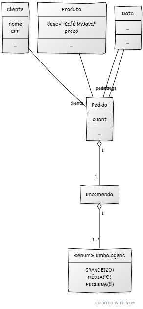

Abaixo é apresentado um esboço de um diagrama de classes UML representando o modelo referente a aplicação descrita acima. Como  um esboço este modelo é incompleto visto que não apresenta os atributos e métodos necessários para a implementação - estes precisarão ser adicionados por cada discente ou dupla de discentes.

Após elaborado o modelo da aplicação, prossiga com a implementação usando a linguagem Java.

Em caso de dúvidas, encaminhá-las para o docente da disciplina por e-mail ou agendar reunião.