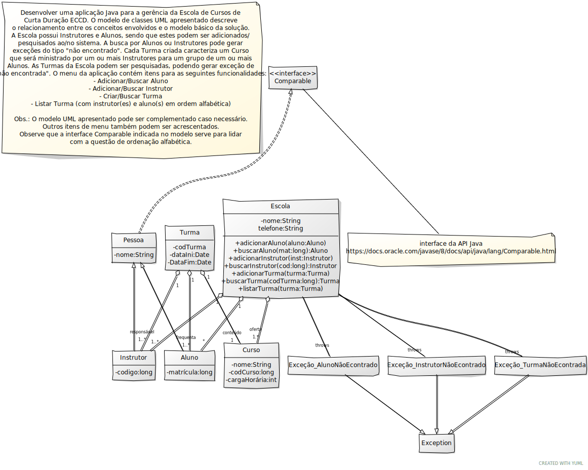

Implementar a aplicação cujo esboço de projeto está apresentado/descrito no diagrama UML abaixo:

- O diagrama de classes apresentado é um esboço e pode (talvez deva) ser complementado.

- Podem ser utilizadas classes da API do Java para a implementação de certos aspectos do exercício. Por exemplo, pode ser utilizada a classe Collections do Java, especificamente o método sort, para ordenar os alunos de uma turma.

- A atividade pode ser realizada em duplas.

- No caso de dúvidas, contatar o docente.